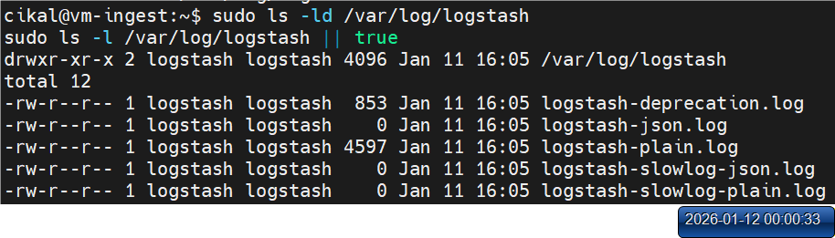

# Kibana

#### Kibana merupakan open source data visualization dan exploration tool untuk Elasticsearch. Log dan time series analytic, aplikasi monitoring, dan kegiatan operasional dapat dengan mudah dilakukan dengan Kibana karena antarmuka web dashboard nya yang rapi membuat pengelolaan dan visualisasi data dari Elasticsearch menjadi sangat lancar.

Berikut **runbook detail opsi 2 (2 VM)** untuk Ubuntu 24.04 dengan IP:

#### Arsitektur & IP

* **VM1 (vm-elk) 192.168.56.21**: Elasticsearch + Kibana
* **VM2 (vm-ingest) 192.168.56.22**: Logstash + Filebeat

| VM      | IP                | Role                                                                              |
| ------- | ----------------- | --------------------------------------------------------------------------------- |
| **VM1** | **192.168.56.21** | **Elasticsearch + Kibana**                                                        |
| **VM2** | **192.168.56.22** | **Logstash + Filebeat** (kirim log → Logstash → Elasticsearch → tampil di Kibana) |

Port yang dipakai:

* **Elasticsearch:** `9200/tcp` (VM1)
* **Kibana:** `5601/tcp` (VM1)
* **Logstash Beats input:** `5044/tcp` (VM2)

***

### 0) Persiapan (DI KEDUA VM)

#### 0.1 Set hostname (opsional)

**VM1**

```bash
sudo hostnamectl set-hostname vm-elk
```

**VM2**

```bash
sudo hostnamectl set-hostname vm-ingest
```

#### 0.2 Set `/etc/hosts` (di keduanya)

```bash
sudo tee -a /etc/hosts >/dev/null <<'EOF'
192.168.56.21  vm-elk
192.168.56.22  vm-ingest
EOF
```

#### 0.3 Paket dasar

```bash
sudo apt-get update
sudo apt-get install -y curl wget gnupg apt-transport-https
```

***

### 1) Tambah Repo Elastic 8.x (DI KEDUA VM)

#### 1.1 Import GPG key

```bash
wget -qO - https://artifacts.elastic.co/GPG-KEY-elasticsearch \
| sudo gpg --dearmor -o /usr/share/keyrings/elasticsearch-keyring.gpg
```

<figure><figcaption></figcaption></figure>

<figure><figcaption></figcaption></figure>

#### 1.2 Tambah repo

```bash
echo "deb [signed-by=/usr/share/keyrings/elasticsearch-keyring.gpg] https://artifacts.elastic.co/packages/8.x/apt stable main" \
| sudo tee /etc/apt/sources.list.d/elastic-8.x.list
```

<figure><figcaption></figcaption></figure>

<figure><figcaption></figcaption></figure>

#### 1.3 Update

```bash
sudo apt-get update
```

Tunggu sampai proses selesai.

***

## VM1 (192.168.56.21) — Elasticsearch + Kibana

### 2) Install & konfigurasi Elasticsearch (VM1)

#### 2.1 Set kernel parameter (wajib untuk ES)

```bash
echo "vm.max_map_count=262144" | sudo tee /etc/sysctl.d/99-elasticsearch.conf
sudo sysctl --system
sysctl vm.max_map_count
```

<figure><figcaption></figcaption></figure>

#### 2.2 Install Elasticsearch

```bash
sudo apt-get install -y ufw
sudo ufw enable
sudo ufw allow 22/tcp
```

```bash
sudo apt-get install -y elasticsearch
```

<figure><figcaption></figcaption></figure>

Tunggu sampai proses selesai.

#### 2.3 Backup & full replace konfigurasi

```bash
sudo systemctl stop elasticsearch

sudo cp -a /etc/elasticsearch/elasticsearch.yml \
  /etc/elasticsearch/elasticsearch.yml.$(date +%F_%H%M%S).bak
sudo ls -lh /etc/elasticsearch/
```

<figure><figcaption></figcaption></figure>

<figure><figcaption></figcaption></figure>

**Full replace** `/etc/elasticsearch/elasticsearch.yml`:

```bash
sudo tee /etc/elasticsearch/elasticsearch.yml >/dev/null <<'EOF'
cluster.name: elk-lab
node.name: vm-elk

path.data: /var/lib/elasticsearch
path.logs: /var/log/elasticsearch

network.host: 0.0.0.0
http.port: 9200

discovery.type: single-node

# LAB ONLY (biar HTTP simple tanpa login)
xpack.security.enabled: false
xpack.security.enrollment.enabled: false
xpack.security.http.ssl.enabled: false
xpack.security.transport.ssl.enabled: false
EOF
```

<figure><figcaption></figcaption></figure>

<figure><figcaption></figcaption></figure>

#### 2.4 (Opsional tapi aman) bersihin keystore yang nyangkut

Kalau sebelumnya pernah enable security/TLS dan sempat error secure\_password:

```bash
sudo /usr/share/elasticsearch/bin/elasticsearch-keystore remove xpack.security.transport.ssl.keystore.secure_password 2>/dev/null || true
sudo /usr/share/elasticsearch/bin/elasticsearch-keystore remove xpack.security.transport.ssl.truststore.secure_password 2>/dev/null || true
sudo /usr/share/elasticsearch/bin/elasticsearch-keystore remove xpack.security.http.ssl.keystore.secure_password 2>/dev/null || true
```

#### 2.5 Start + enable

```bash
sudo systemctl daemon-reload
sudo systemctl enable --now elasticsearch
sudo systemctl is-active elasticsearch
```

<figure><figcaption></figcaption></figure>

Tunggu sampai proses selesai.

#### 2.6 Verifikasi Elasticsearch (CLI + Browser)

**CLI (VM1)**

```bash
curl -s http://127.0.0.1:9200 | head
curl -s http://127.0.0.1:9200/_cluster/health?pretty
```

<figure><figcaption></figcaption></figure>

**Browser (WAJIB — yang kemarin kelewat)**

* Buka di browser host/laptop kamu:
  * [**http://192.168.56.21:9200**](http://192.168.56.21:9200/)
* Harus muncul JSON info cluster (name, version, dsb).

<figure><figcaption></figcaption></figure>

Kalau gagal:

```bash
sudo journalctl -u elasticsearch -n 120 --no-pager
```

#### 2.7 Firewall (opsional, kalau kamu memang pakai UFW)

> Hati-hati: kalau ini VM remote, pastikan **port 22** di-allow dulu biar nggak ngunci SSH.

```bash
sudo ufw allow 22/tcp
sudo ufw allow 9200/tcp
sudo ufw allow 5601/tcp
sudo ufw --force enable
sudo ufw status
```

<figure><figcaption></figcaption></figure>

***

### 3) Install & konfigurasi Kibana (VM1)

#### 3.1 Install

```bash
sudo apt-get install -y kibana
```

<figure><figcaption></figcaption></figure>

Tunggu sampai proses selesai.

#### 3.2 Backup & full replace `kibana.yml`

```bash
sudo cp -a /etc/kibana/kibana.yml /etc/kibana/kibana.yml.$(date +%F_%H%M%S).bak
```

<figure><figcaption></figcaption></figure>

```bash
sudo tee /etc/kibana/kibana.yml >/dev/null <<'EOF'
server.host: "0.0.0.0"
server.port: 5601
elasticsearch.hosts: ["http://192.168.56.21:9200"]
EOF
```

<figure><figcaption></figcaption></figure>

#### 3.3 Start + enable

```bash
sudo systemctl enable --now kibana
sudo systemctl is-active kibana
```

<figure><figcaption></figcaption></figure>

#### 3.4 Verifikasi Kibana (CLI + Browser)

**CLI**

```bash
curl -I -s http://127.0.0.1:5601 | head -n 1
```

**Browser**

* [**http://192.168.56.21:5601**](http://192.168.56.21:5601/)

<figure><figcaption></figcaption></figure>

Kalau Kibana lambat/failed:

```bash
sudo journalctl -u kibana -n 120 --no-pager
```

***

## VM2 (192.168.56.22) — Logstash + Filebeat

### 4) Install & konfigurasi Logstash (VM2)

#### 4.1 Install

```bash
sudo apt-get install -y ufw
sudo ufw enable
sudo ufw allow 22/tcp
sudo apt-get install -y lsof
```

```bash
sudo apt-get install -y logstash
```

<figure><figcaption></figcaption></figure>

Tunggu sampai proses selesai.

#### 4.2 Buat pipeline Logstash (Beats 5044 → Elasticsearch VM1)

Backup kalau file sudah ada:

```bash
sudo mkdir -p /etc/logstash/conf.d
sudo cp -a /etc/logstash/conf.d/beats-to-elasticsearch.conf \
  /etc/logstash/conf.d/beats-to-elasticsearch.conf.$(date +%F_%H%M%S).bak 2>/dev/null || true
```

<figure><figcaption></figcaption></figure>

Full replace config:

```bash
sudo tee /etc/logstash/conf.d/beats-to-elasticsearch.conf >/dev/null <<'CONF'
input {
  beats {
    port => 5044
    ssl => false
  }
}

output {
  elasticsearch {
    hosts => ["http://192.168.56.21:9200"]
    index => "filebeat-%{+YYYY.MM.dd}"
  }
  stdout { codec => rubydebug }
}
CONF
```

<figure><figcaption></figcaption></figure>

Stop Service dahulu

```bash
sudo systemctl stop logstash
```

Buat folder dan set permission

```bash
sudo mkdir -p /var/log/logstash
sudo chown -R logstash:logstash /var/log/logstash
sudo chmod 0755 /var/log/logstash

sudo mkdir -p /var/lib/logstash/queue /var/lib/logstash/dead_letter_queue
sudo chown -R logstash:logstash /var/lib/logstash
sudo chmod 0755 /var/lib/logstash
sudo chmod 0755 /var/lib/logstash/queue /var/lib/logstash/dead_letter_queue
```

Cek

```bash
sudo ls -ld /var/log/logstash
sudo ls -l /var/log/logstash || true
sudo ls -ld /var/lib/logstash /var/lib/logstash/queue /var/lib/logstash/dead_letter_queue
```

<figure><figcaption></figcaption></figure>

<figure><figcaption></figcaption></figure>

Restart

```bash
sudo systemctl restart logstash
```

Cek user `logstash` bisa nulis ke queue atau tidak

```bash
sudo -u logstash bash -lc '
set -e
echo "whoami=$(whoami)"
echo "test -w queue:"
test -w /var/lib/logstash/queue && echo "OK: writable" || echo "FAIL: not writable"
echo "try touch:"
touch /var/lib/logstash/queue/.writetest
echo "OK: touch success"
rm -f /var/lib/logstash/queue/.writetest
'
```

<figure><figcaption></figcaption></figure>

#### 4.3 Test config Logstash (biar yakin sebelum start)

```bash
sudo /usr/share/logstash/bin/logstash --path.settings /etc/logstash -t
```

<figure><figcaption></figcaption></figure>

#### 4.4 Cek port

```bash
sudo ss -lntp | grep ':5044' || echo "PORT 5044 TIDAK LISTEN"
```

<figure><figcaption></figcaption></figure>

#### 4.5 Firewall (opsional, kalau pakai UFW)

```bash
sudo ufw allow 22/tcp
sudo ufw allow 5044/tcp
sudo ufw --force enable
sudo ufw status
```

<figure><figcaption></figcaption></figure>

***

### 5) Install & konfigurasi Filebeat (VM2) — versi “SIMPLE MODE journald” (yang terbukti berhasil)

#### 5.1 Install

```bash
sudo apt-get install -y filebeat
```

<figure><figcaption></figcaption></figure>

Tunggu sampai proses selesai.

#### 5.2 Backup & full replace `filebeat.yml`

```bash
sudo cp -a /etc/filebeat/filebeat.yml /etc/filebeat/filebeat.yml.$(date +%F_%H%M%S).bak
```

<figure><figcaption></figcaption></figure>

```bash
sudo tee /etc/filebeat/filebeat.yml >/dev/null <<'YAML'
# =========================
# Filebeat - SIMPLE MODE (journald -> logstash)
# Inputs: /etc/filebeat/inputs.d/*.yml
# Output: Logstash (local)
# =========================

filebeat.config.inputs:
  enabled: true
  path: /etc/filebeat/inputs.d/*.yml
  reload.enabled: false

# Nonaktifkan modules biar tidak “campur aduk”
filebeat.config.modules:
  enabled: false

output.logstash:
  hosts: ["127.0.0.1:5044"]

logging.level: info
logging.to_files: true
logging.files:
  path: /var/log/filebeat
  name: filebeat
  keepfiles: 7
  permissions: 0644
YAML
```

<figure><figcaption></figcaption></figure>

<figure><figcaption></figcaption></figure>

#### 5.3 Buat input journald khusus labfinal

```bash
sudo mkdir -p /etc/filebeat/inputs.d

sudo tee /etc/filebeat/inputs.d/00-journald-labfinal.yml >/dev/null <<'YAML'
- type: journald
  id: journald-labfinal
  seek: tail
  include_matches:
    - "SYSLOG_IDENTIFIER=labfinal"
YAML
```

<figure><figcaption></figcaption></figure>

#### 5.4 Test config + restart

```bash
sudo filebeat test config -e
sudo systemctl enable --now filebeat
sudo systemctl restart filebeat
sudo systemctl is-active filebeat
```

<figure><figcaption></figcaption></figure>

Kalau mau cek log cepat:

```bash
sudo journalctl -u filebeat -n 80 --no-pager | egrep -i 'error|fail|journald|started|input|harvester' || true
```

***

## 6) Verifikasi end-to-end (logger → filebeat → logstash → elasticsearch → kibana)

### 6.1 Buat event test (VM2)

```bash
logger -t labfinal "FINAL_TEST_$(date +%s)"
sudo journalctl -t labfinal -n 3 --no-pager -o short-iso
```

<figure><figcaption></figcaption></figure>

### 6.2 Pastikan Logstash masih listen (VM2)

```bash
sudo ss -lntp | grep ':5044' || echo "PORT 5044 TIDAK LISTEN"
sudo journalctl -u logstash -n 120 --no-pager | egrep -i 'error|exception|pipeline|beats|5044|elasticsearch|failed' || true
```

### 6.3 Cek index & cari event di Elasticsearch (VM1)

#### Cek index ada

```bash
curl -s 'http://192.168.56.21:9200/_cat/indices?v' | grep -i filebeat || echo "belum ada index filebeat"
```

<figure><figcaption></figcaption></figure>

#### Cari event FINAL\_TEST / labfinal (query yang kamu pakai dan sudah terbukti)

```bash
curl -sG 'http://192.168.56.21:9200/filebeat-*/_search' \
  --data-urlencode 'size=5' \
  --data-urlencode 'sort=@timestamp:desc' \
  --data-urlencode 'q=labfinal OR FINAL_TEST_*' \
  --data-urlencode '_source_includes=@timestamp,message,event.original,log.syslog.*,process.name,agent.*,host.*' \
  --data-urlencode 'filter_path=hits.total.value,hits.hits._index,hits.hits._source' \
| sed 's/},{/},\n{/g'
```

<figure><figcaption></figcaption></figure>

<figure><figcaption></figcaption></figure>

Kalau `hits.total.value` > 0 berarti **AMAN** (pipeline jalan).

***

## 7) Verifikasi di Browser (Kibana + Elasticsearch)

### 7.1 Elasticsearch (yang tadi kamu minta ditambah)

* [**http://192.168.56.21:9200**](http://192.168.56.21:9200/)\
  Harus muncul JSON cluster.

<figure><figcaption></figcaption></figure>

### 7.2 Kibana

* [**http://192.168.56.21:5601**](http://192.168.56.21:5601/)

Langkah di Kibana:

1. Masuk menu **Discover**
2. Buat **Data View**:
   * Name: bebas
   * Index pattern: `filebeat-*`
   * Time field: `@timestamp`
3. Di Discover, coba search:
   * `message : FINAL_TEST_*`\
     atau
   * `log.syslog.appname : labfinal`

<figure><figcaption></figcaption></figure>

***

## 8) Quick check super sederhana (biar kamu nggak muter-muter)

### VM1

```bash
sudo systemctl is-active elasticsearch kibana
sudo ss -lntp | egrep ':(9200|5601)\s' || true
curl -s http://127.0.0.1:9200 >/dev/null && echo "ES OK"
curl -I -s http://127.0.0.1:5601 | head -n 1
```

### VM2

```bash
sudo systemctl is-active logstash filebeat
sudo ss -lntp | grep ':5044' || echo "5044 tidak listen"
```

***

## 9) Troubleshooting singkat (yang relevan dari kasus kamu)

#### A) Index ada tapi `FINAL_TEST` nggak ketemu

* Pastikan kamu pakai input **journald + include\_matches labfinal** (seperti runbook final ini).
*   Pastikan event benar-benar ada di journald:

    ```bash
    sudo journalctl -t labfinal -n 5 --no-pager
    ```

#### B) Filebeat error “use of closed network connection” / connect error

* Biasanya Logstash restart / port 5044 belum siap.
  *   Cek:

      ```bash
      sudo ss -lntp | grep ':5044'
      sudo systemctl restart logstash
      sudo systemctl restart filebeat
      ```

#### C) Logstash jalan tapi tidak kirim ke Elasticsearch

*   Tes dari VM2:

    ```bash
    curl -s http://192.168.56.21:9200 | head
    ```
*   Cek logstash logs:

    ```bash
    sudo journalctl -u logstash -n 200 --no-pager | egrep -i 'error|exception|elasticsearch|failed'
    ```

***
